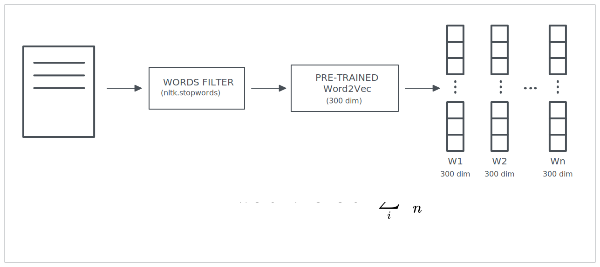

# Natural-Language-Processing-Text-Classification
Text Classification using Word2Vec and a multi-layer perceptron

Text classification is the task of assigning a sentence or document an appropriate category. The considered classes in this project are 15: 
- business
- crime
- culture/arts
- education
- entertainment
- environment
- food/drink
- home/living
- media
- politics
- religion
- sci/tech
- sports
- wellness
- world

In the project specification advanced architectures like LSTMs and Transformer-based architectures were not allowed.
The proposed solution is then based on a pre-trained Word Embeddings (Word2Vec) and Multi-Layer Perceptron model (i.e., neural network).

### .FEATURE EXTRACTION
Each document is vectorized into a 434 dimensional vector, then is given as input to a multi-layer perceptron which predicts its text category.

The 434 dimensional vector is composed by the following parts:
- **Number of sentences (scalar integer):** Number of sentences in the document;
- **Average sentence length (scalar integer):** Average sentence length in the document;
- **Minimum sentence length (scalar integer):** Minimum sentence length in the document;
- **Maximum sentence length (scalar integer):** Maximum sentence length in the document;
- **Mean word vector (300-dim float vector):** Average vector obtained by computing the mean of the word vectors in the document. See below;
- **Similarity bag (127-dim integer vector):** See below;
- **Count numbers in \[1600, 2500\] (scalar integer):** Count the number of dates in the document;
- **Count numbers not in \[1600, 2500\] (scalar integer):** Count the occurrences of numbers which are not dates in the document;
- **Count unknown word (scalar integer):** Count of words in the document for which the word embedding used does not have a representation. 

 #### Mean word vector (300-dim float vector)

#### Similarity bag
127 keywords were selected by using the training documents, they were chosen by looking at the most common words for each text category. 
A 127 dimensional bag vector is then built, each element (bag) corresponds to the number of occurrences of that keyword in the document. For the words that are not keywords, they are associated to the most similar keyword by using cosine similarity.

### .PERFORMANCE
The accuracy obtained in the test set is 74%.